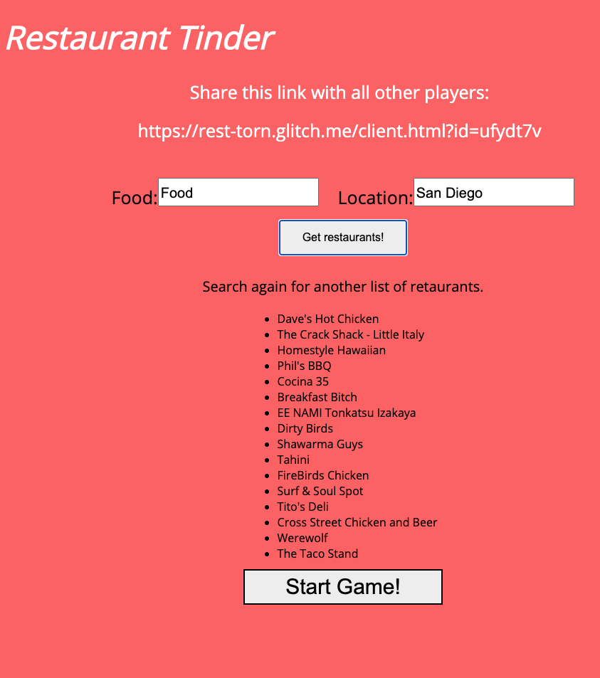

# Restaurant Tinder
You can play the game here at https://resttinder.glitch.me/

I created a Restaurant Tinder app that you can play with friends to helps narrow down a restaurant to go to. Using the Yelp API I get a list of 16 restaurants and each round has two restaurants and each player will pick one. After each round, whichever restaurant had the most votes moves onto the next round. Once the 8 rounds are over, there will be a winner. 

